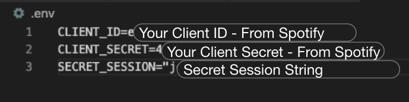

# H.I.I.T.S. - High Intensity Interval Training Songs

## Description 
### A webapp for gym users to share their favorite songs with gym owners.
Poor music choices plague many gyms, leading to frustration on the part of trainers and members. 
Though H.I.T.T.S. will not eliminate this frustration completely, it is a step in allievating the universal discomfort. 

### How It Works
Users create an account using their email address and name. \
Once logged in members can search the Spotify database for their favorite songs.
Results are returned with the artist, length, explicit lyrics notification, and 30 second preview (if available). Once a gym friendly track is selected, members click the "Add to Favorites" button. \
To see a list of favorite tracks, members click the "Favorites" menu option. \
Users may change their profile name by clicking Profile and entering a new name.

Administrators have the same functionality as members. However, when an admin views Favorites, they will see all tracks added by all gym members. 
By reviewing the gym members favorite songs, playlists can be created on the platform of the administrators choice. \
NOTE: Playlist creation is outside the scope of H.I.T.T.S.

### How to Install
IMPORTANT NOTE
H.I.I.T.S. requires a Spotify Developer app. You must have a Spotify account (free) before proceeding.\
-To create your Spotify App, go to the [Developer Dashboard](https://developer.spotify.com/dashboard/applications) and click `Create An App`.\
-Provide and app name and brief description. Accept the terms and conditions and click `Create`. \
-The client ID and client secret are available here. Refer to these codes after installation. \
-Click the `Edit Settings` button. 
-Type in your redirect URI. Typically this will be `http://localhost:3005`. Should you prefer a different port, change the port value to match your local application setting. \
-Click Add. \
-At the bottom of `Edit Settings` click the `Save` button to complete Spotify setup. 

To install H.I.I.T.S., clone the [git repository](https://github.com/JJURIZ/H.I.I.T.S.). \
-Once cloned, use the CLI to navigate to the cloned directory. \
-Run `npm install` to install the necessary dependencies. \
-Create a new file called `.env` in the root directory of the application. This will be used to store sensitive app information. 
-Open the app directory in your preferred editor. \
-Open the `.env` file created previously. 
-Record your CLIENT_ID, CLIENT_SECRET, and create a SECRET_SESSION string. See image below for example: \
 \
-Launch the application using the command `node server.js`. \
-In your browser, navigate to `localhost:3005`

## Technologies Used
JavaScript, Express, CSS, EJS, Postgres, and Sequelize

## SQL Tables 
### User Table
|name   |email   |password   |isAdmin   |
|---|---|---|---|---|
|Joe Smith   |joesmith@email.com   |pa$$word   |f  | 

### Track Table
|title   |artist   |explicit   |durationMs   |spotify_id |preview_url 
|---|---|---|---|---|---|
|Song #2  |Blur   |f  |198000  |3GfOAdcoc3X5GPiiXmpBjK |spotify:track:3GfOAdcoc3X5GPiiXmpBjK

### Fave Table (JOIN)
|userId  |spotify_id  |
|---|---|
|3  |3GfOAdcoc3X5GPiiXmpBjK   |

